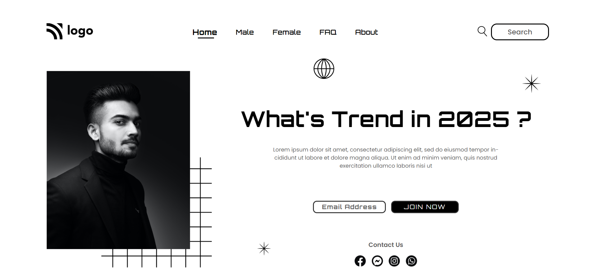

# Street Style Landing Page | 

Hello,

I'm `Ammar Azam Khan`. This is the 1st assignment in my `Full Stack Javascript Bootcamp`, where I developed this website.This website is not responsive.

The Landing page contains:

- Navbar
- Hero Section

## 🛠 Technologies Used

&emsp; &ensp;  

## 💻Check out the link below for a preview.

&emsp; &ensp; `note` This site is not responsive.

&emsp; &ensp; &ensp;[Live Preview](https://landing-page-street-style.netlify.app)

## 📸 Screenshot

## 📝 My learning from this project

- This project is mainly based on positioning.
- I learned about position relative and position absolute.
- I learned about z-index.

## ⌛ Time taken to finish the project

- Approximately `3 hours`.
